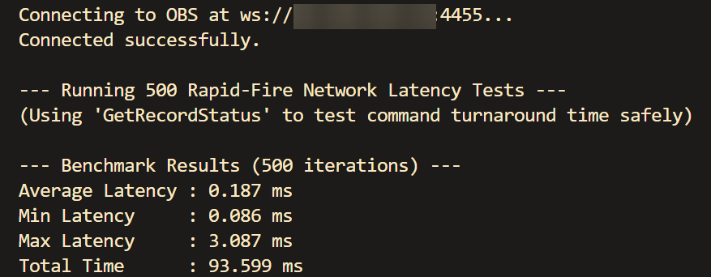

# OBS Instant-Trigger Web Controller

A super-low-latency web controller to toggle OBS recording from your phone or any device on your network.
Benchmark results:


## Setup with Docker (Recommended)

1. Clone or download this repository to your server.
2. Run using Docker Compose:

```bash
docker-compose up -d
```

The server will be available at `http://<your-ip>:44253`.

### How to Update
```bash
docker compose down
git pull
docker compose up -d --build
```

## Setup with Bun (Local Dev)

If you don't want to use Docker, you can run it directly with [Bun](https://bun.sh/).

1. Install dependencies:
```bash
bun install
```

2. Start the server:
```bash
bun run start
```

The server defaults to `http://localhost:44253` (unless `PORT` is set).

## Benchmark

```bash
bun run benchmark <ip> <port> <password>
```

Example:
```bash
bun run benchmark 1.1.1.1 4455 CWiG29BFmj5igpKP
```
(just some random password I generated off Bitwarden)

yes I used kilo code for this.